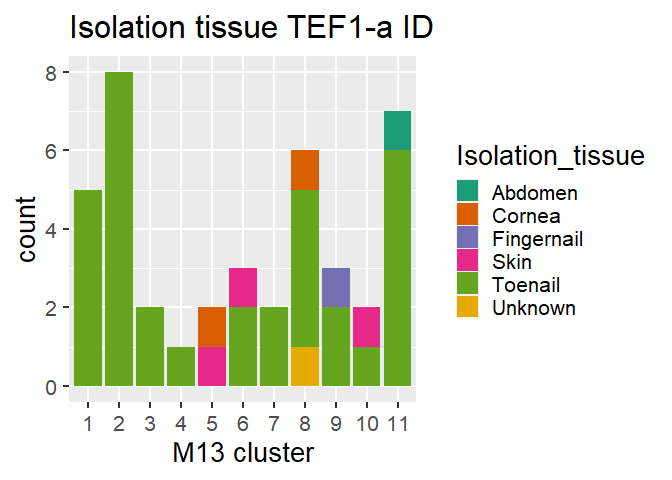

*Fusarim* Genotyping md
================

## *Fusarium* clustering analysis

We start by opening the files and set up thresholds for antimycotic
susceptibility:

``` r
library(tidyverse)

path="inputs"

strain<- read.csv(paste0(path, "/strain_info2.csv"), na.strings = "")
genotypes<- read.csv(paste0(path, "/clusters_GACA4_M13.csv"))
suscep<- read.csv(paste0(path, "/antimicotic_suscep.csv"))
genotypes2<- merge(genotypes[genotypes$marker=="GACA4", ], genotypes[genotypes$marker=="M13", ], by="strain", all=T)
colnames(genotypes2)<- c("strain", "marker_GACA4", "genotype_GACA4","cluster_GACA4", "cluster_LR_GACA4",
                         "marker_M13", "genotype_M13", "cluster_M13", "cluster_LR_M13" )

genotypes2<- merge(genotypes2, strain, by="strain", all=T)
genotypes2<- merge(genotypes2, suscep, by="strain", all=T)

genotypes2$genotype_M13<- factor(genotypes2$genotype_M13, levels = str_sort(unique(as.character(genotypes2$genotype_M13)), numeric = T))
genotypes2$Voriconazol_phenotype<- ifelse(genotypes2$Voriconazol<=0.1, "S", ifelse(genotypes2$Voriconazol<=2, "SDD", "R"))
genotypes2$Amp_phenotype<- ifelse(genotypes2$Amphotericin_B<=0.1, "S", ifelse(genotypes2$Amphotericin_B<=4, "SDD", "R"))
```

## Plots

Now we plot the distributions

``` r
ggplot(genotypes2[!is.na(genotypes2$cluster_LR_M13) & !is.na(genotypes2$TEF1_a),], 
       aes(fill=TEF1_a, x=as.factor(cluster_LR_M13))) + geom_bar(position="stack", stat="count") +
  ggtitle("TEF1-a distribution") +  xlab("M13 cluster")+ theme_grey(base_size = 20)+
  scale_fill_brewer(palette="Dark2")
```

<!-- -->

``` r
ggplot(genotypes2[!is.na(genotypes2$cluster_LR_M13) & !is.na(genotypes2$rDNA_28S),],
       aes(fill=rDNA_28S, x=as.factor(cluster_LR_M13))) + geom_bar(position="stack", stat="count") +
  ggtitle("28S ID distribution") +  xlab("M13 cluster")+ scale_fill_brewer(palette="Dark2")+
  theme_grey(base_size = 20)
```

<!-- -->

``` r
ggplot(genotypes2[!is.na(genotypes2$cluster_LR_M13) & !is.na(genotypes2$TEF1_a),],
       aes(fill=Isolation_tissue,  x=as.factor(cluster_LR_M13))) + 
  geom_bar(position="stack", stat="count") + ggtitle("Isolation tissue TEF1-a ID") +
  xlab("M13 cluster")+ theme_grey(base_size = 20)+ scale_fill_brewer(palette="Dark2")
```

<!-- -->

``` r
#GACA4
ggplot(genotypes2[!is.na(genotypes2$cluster_LR_GACA4) & !is.na(genotypes2$TEF1_a),], 
       aes(fill=TEF1_a, x=as.factor(cluster_LR_GACA4))) + 
  geom_bar(position="stack", stat="count") + ggtitle("TEF1-a distribution") +
  xlab("GACA4 cluster")+ scale_fill_brewer(palette="Dark2")+ theme_grey(base_size = 20)
```

<!-- -->

``` r
ggplot(genotypes2[!is.na(genotypes2$cluster_LR_GACA4) & !is.na(genotypes2$rDNA_28S),],
       aes(fill=rDNA_28S, x=as.factor(cluster_LR_GACA4))) + 
  geom_bar(position="stack", stat="count") + ggtitle("28S ID distribution") +
  xlab("GACA4 cluster")+ scale_fill_brewer(palette="Dark2")+ theme_grey(base_size = 20)
```

<!-- -->

``` r
ggplot(genotypes2[!is.na(genotypes2$cluster_LR_GACA4) & !is.na(genotypes2$TEF1_a),],
       aes(fill=Isolation_tissue,  x=as.factor(cluster_LR_GACA4))) + 
  geom_bar(position="stack", stat="count") + ggtitle("Isolation tissue TEF1-a ID") +
  xlab("GACA4 cluster")+ theme_grey(base_size = 20)+ scale_fill_brewer(palette="Dark2")
```

<!-- -->

``` r
#antimicotic resistance
colfunc<-colorRampPalette(c("blue","red"))
#plot(rep(1,50),col=(colfunc(50)), pch=19,cex=2)

ggplot(genotypes2[!is.na(genotypes2$cluster_LR_M13) & !is.na(genotypes2$Voriconazol),],
       aes(fill=as.factor(Voriconazol), x=as.factor(cluster_LR_M13))) + 
  geom_bar(position="stack", stat="count") + ggtitle("Voriconazol response") +
  xlab("M13 cluster")+ theme_grey(base_size = 20)+scale_fill_manual(values=colfunc(12))
```

<!-- -->

``` r
ggplot(genotypes2[!is.na(genotypes2$cluster_LR_M13) & !is.na(genotypes2$Amphotericin_B),],
       aes(fill=as.factor(Amphotericin_B), x=as.factor(cluster_LR_M13))) + 
  geom_bar(position="stack", stat="count") + ggtitle("Amphotericin B response") +
  xlab("M13 cluster")+ scale_fill_manual(values=colfunc(6))+ theme_grey(base_size = 20)
```

<!-- -->

## DI calculations

``` r
calculate_HGDI<- function(genotypes){
  HGDI<- 1-(sum(mapply(function(x) sum(genotypes==x)*(sum(genotypes==x)-1), unique(genotypes))))/(length(genotypes)*(length(genotypes)-1))
  return(HGDI)
}

HGDI_M13_cluster<- calculate_HGDI(genotypes2$cluster_M13[!is.na(genotypes2$cluster_M13)])

HGDI_M13_cluster_LR<- calculate_HGDI(genotypes2$cluster_LR_M13[!is.na(genotypes2$cluster_LR_M13)])

HGDI_M13_genotype<- calculate_HGDI(genotypes2$genotype_M13[!is.na(genotypes2$genotype_M13)])


HGDI_GACA4_cluster<- calculate_HGDI(genotypes2$cluster_GACA4[!is.na(genotypes2$cluster_GACA4)])

HGDI_GACA4_cluster_LR<- calculate_HGDI(genotypes2$cluster_LR_GACA4[!is.na(genotypes2$cluster_LR_GACA4)])

HGDI_GACA4_genotype<- calculate_HGDI(genotypes2$genotype_GACA4[!is.na(genotypes2$genotype_GACA4)])


HGDI_PCR_molec<- calculate_HGDI(genotypes2$spp_molec[!is.na(genotypes2$spp_molec)])


HGDI_H_TFE1_a<- calculate_HGDI(genotypes2$haplotype_TEF1_a[!is.na(genotypes2$haplotype_TEF1_a)])

HGDI_H_28S<- calculate_HGDI(genotypes2$haplotype_28S_rDNA[!is.na(genotypes2$haplotype_28S_rDNA)])

HGDI_table<- data.frame(Method=c("M13_cluster_LR", "M13_cluster_HR", "M13_genotype",
                                 "(GACA)4_cluster_LR", "(GACA)4_cluster_HR","(GACA)4_genotype",
                                 "PCR_ID", "TEF1_a_Haplotypes", "rDNA_28S_Haplotypes"),
                        HGDI=c(HGDI_M13_cluster_LR, HGDI_M13_cluster, HGDI_M13_genotype,
                               HGDI_GACA4_cluster_LR, HGDI_GACA4_cluster, HGDI_GACA4_genotype,
                               HGDI_PCR_molec, HGDI_H_TFE1_a, HGDI_H_28S))
HGDI_table
```

    ##                Method      HGDI
    ## 1      M13_cluster_LR 0.8693069
    ## 2      M13_cluster_HR 0.9269307
    ## 3        M13_genotype 0.9970297
    ## 4  (GACA)4_cluster_LR 0.8932039
    ## 5  (GACA)4_cluster_HR 0.8932039
    ## 6    (GACA)4_genotype 0.9156087
    ## 7              PCR_ID 0.5234649
    ## 8   TEF1_a_Haplotypes 0.8304878
    ## 9 rDNA_28S_Haplotypes 0.7777778

## Hypergeometric tests

We build a function to test the enrichment of different characteristicas
acorss the molecular identification of the isolates

``` r
HG_test<- function(trts_name, cluster_name, cluster_table){
  library(effsize)
  #table trts by clusters
  cluster_table_filtered<- cluster_table[!is.na(cluster_table[,trts_name]) & !is.na(cluster_table[,cluster_name]), c(cluster_name,trts_name)]
  trts<- unique(cluster_table_filtered[,trts_name])
  hypergeom_test <- data.frame(matrix(ncol = 1+2*length(trts), nrow = length(unique(cluster_table_filtered[,cluster_name])))) 
  #hypergeom_test[,1]<- unique(cluster_table_filtered[,cluster_name])
  colnames(hypergeom_test)<- c(cluster_name, unlist(sapply(trts, function(x) c(paste0(x,"_HG_pvalue"), paste0(x,"_HG_padj")))))
  IDs_cluster<- data.frame(table(cluster_table_filtered[,cluster_name]))
  hypergeom_test[,1]<-IDs_cluster$Var1
  
  for(m in trts){
    IDs_trt<-data.frame(table(cluster_table_filtered[cluster_table_filtered[,trts_name]==m, cluster_name]))
    IDs_trt<- merge(IDs_trt, IDs_cluster, by="Var1", all.x=T)
    hypergeom_test[match(IDs_trt$Var1, hypergeom_test[,cluster_name]), 
                   paste0(m,"_HG_pvalue")]<- phyper(IDs_trt$Freq.x, sum(cluster_table_filtered[,trts_name]==m), 
                                                    sum(IDs_trt$Freq.y - IDs_trt$Freq.x), 
                                                    IDs_trt$Freq.y, lower.tail = FALSE)
    
    hypergeom_test[hypergeom_test[,cluster_name] %in% IDs_trt$Var1, paste0(m,"_HG_padj")]<- p.adjust(hypergeom_test[hypergeom_test[,cluster_name] %in% IDs_trt$Var1, paste0(m,"_HG_pvalue")], method = "BH")
    
  }
  hypergeom_test<- hypergeom_test[rowSums(is.na(hypergeom_test[,-1])) != ncol(hypergeom_test[,-1]), ]
  return(hypergeom_test)
}

HG_Voriconazol<- HG_test(trts_name="Voriconazol", cluster_name="cluster_LR_M13", cluster_table=genotypes2)
HG_Voriconazol_phen<- HG_test(trts_name="Voriconazol_phenotype", cluster_name="cluster_LR_M13", cluster_table=genotypes2)
HG_Amfotericin_B<- HG_test(trts_name="Amphotericin_B", cluster_name="cluster_LR_M13", cluster_table=genotypes2)
HG_Amfotericin_B_phen<- HG_test(trts_name="Amp_phenotype", cluster_name="cluster_LR_M13", cluster_table=genotypes2)

HG_TEF1_a<- HG_test(trts_name="TEF1_a", cluster_name="cluster_LR_M13", cluster_table=genotypes2)
HG_28S<- HG_test(trts_name="rDNA_28S", cluster_name="cluster_LR_M13", cluster_table=genotypes2)
HG_tissue<- HG_test(trts_name="Isolation_tissue", cluster_name="cluster_LR_M13", cluster_table=genotypes2)
HG_gender<- HG_test(trts_name="Gender", cluster_name="cluster_LR_M13", cluster_table=genotypes2)

HG_TEF1_a_GACA4<- HG_test(trts_name="TEF1_a", cluster_name="cluster_GACA4", cluster_table=genotypes2)
HG_28S_GACA4<- HG_test(trts_name="rDNA_28S", cluster_name="cluster_GACA4", cluster_table=genotypes2)
HG_tissue_GACA4<- HG_test(trts_name="Isolation_tissue", cluster_name="cluster_GACA4", cluster_table=genotypes2)

HG_tissue
```

    ##    cluster_LR_M13 Toenail_HG_pvalue Toenail_HG_padj Unknown_HG_pvalue
    ## 1               1         0.0000000       0.0000000                NA
    ## 2               2         0.2318730       0.4637460                NA
    ## 3               3         0.0000000       0.0000000                NA
    ## 4               4         0.0000000       0.0000000                NA
    ## 5               5                NA              NA                NA
    ## 6               6         0.5275952       0.5862169                NA
    ## 7               7         0.0000000       0.0000000                NA
    ## 8               8         0.5273951       0.5862169                 0
    ## 9               9         0.6851128       0.6851128                NA
    ## 10             10         0.4031273       0.5862169                NA
    ## 11             11         0.5273951       0.5862169                NA
    ##    Unknown_HG_padj Skin_HG_pvalue Skin_HG_padj Cornea_HG_pvalue Cornea_HG_padj
    ## 1               NA             NA           NA               NA             NA
    ## 2               NA             NA           NA               NA             NA
    ## 3               NA             NA           NA               NA             NA
    ## 4               NA             NA           NA               NA             NA
    ## 5               NA     0.03296703    0.0989011       0.00952381     0.01904762
    ## 6               NA     0.27472527    0.4120879               NA             NA
    ## 7               NA             NA           NA               NA             NA
    ## 8                0             NA           NA       0.74285714     0.74285714
    ## 9               NA             NA           NA               NA             NA
    ## 10              NA     0.50000000    0.5000000               NA             NA
    ## 11              NA             NA           NA               NA             NA
    ##    Fingernail_HG_pvalue Fingernail_HG_padj Abdomen_HG_pvalue Abdomen_HG_padj
    ## 1                    NA                 NA                NA              NA
    ## 2            0.41282459         0.44071466                NA              NA
    ## 3                    NA                 NA                NA              NA
    ## 4                    NA                 NA                NA              NA
    ## 5                    NA                 NA                NA              NA
    ## 6                    NA                 NA                NA              NA
    ## 7                    NA                 NA                NA              NA
    ## 8                    NA                 NA                NA              NA
    ## 9            0.02599743         0.07799228                NA              NA
    ## 10                   NA                 NA                NA              NA
    ## 11           0.44071466         0.44071466                 0               0

## AMOVA and Mantel test

``` r
#AMOVA
library("adegenet")
library("pegas")
library("mmod")
library("reshape2")
library("ggplot2")
library("proxy")

genotypes2$haplotypes<- paste0(genotypes2$haplotype_28S_rDNA, "_",genotypes2$haplotype_TEF1_a)
M13_dist  <- read.csv(paste0(path, "/M13_matrix.csv"), row.names = 1)
M13_dist$X[duplicated(rownames(M13_dist))]
```

    ## NULL

``` r
M13_stra  <- genotypes2[genotypes2$strain %in% rownames(M13_dist), ]
rownames(M13_dist)[!rownames(M13_dist)%in% genotypes2$strain]
```

    ## character(0)

``` r
colnames(M13_dist)<- rownames(M13_dist)
M13_dist<- as.matrix(M13_dist[M13_stra$strain, M13_stra$strain])
M13_stra$Isolation_tissue<- as.factor(M13_stra$Isolation_tissue)
M13_stra$spp_molec<- as.factor(M13_stra$spp_molec)
M13_stra$haplotypes<- as.factor(M13_stra$haplotypes)

M13_dist5<-M13_dist[M13_stra$strain[M13_stra$haplotypes!="NA_NA"],M13_stra$strain[M13_stra$haplotypes!="NA_NA"]]
#M13_dist4 = 1-M13_dist4
M13_dist5 = as.dist(M13_dist5)
M13_amova5 <- pegas::amova(M13_dist5 ~ haplotypes, data = M13_stra[M13_stra$haplotypes!="NA_NA", ], nperm = 100)
M13_amova5
```

    ## 
    ##  Analysis of Molecular Variance
    ## 
    ## Call: pegas::amova(formula = M13_dist5 ~ haplotypes, data = M13_stra[M13_stra$haplotypes != 
    ##     "NA_NA", ], nperm = 100)
    ## 
    ##                 SSD      MSD df
    ## haplotypes  7768914 323704.7 24
    ## Error       3396575 212285.9 16
    ## Total      11165489 279137.2 40
    ## 
    ## Variance components:
    ##            sigma2 P.value
    ## haplotypes  71100  0.0297
    ## Error      212286        
    ## 
    ## Phi-statistics:
    ## haplotypes.in.GLOBAL 
    ##            0.2508945 
    ## 
    ## Variance coefficients:
    ##        a 
    ## 1.567073

``` r
#Mantel test
library("cultevo")
library("seqinr")
library("LncFinder")
library("Biostrings")
library("DECIPHER")
library("ade4")
path="inputs"

TEF1_a_stringset<-readDNAStringSet(paste0(path, "/fac_elon.fasta"))
TEF1_a_dist2<- DistanceMatrix(TEF1_a_stringset, type="matrix")
```

    ## ================================================================================
    ## 
    ## Time difference of 0 secs

``` r
TEF1_a_dist3<- DistanceMatrix(TEF1_a_stringset, type="dist")              
```

    ## ================================================================================
    ## 
    ## Time difference of 0 secs

``` r
is.euclid(TEF1_a_dist3)
```

    ## [1] FALSE

``` r
# cool the distances matrices are euclidian :)

# to compare the 2 matrices
M13_dist5<-as.dist(M13_dist[rownames(TEF1_a_dist2), rownames(TEF1_a_dist2)])
mt1 <- mantel.randtest(M13_dist5,TEF1_a_dist3,nrepet=10000)
mt1
```

    ## Monte-Carlo test
    ## Call: mantel.randtest(m1 = M13_dist5, m2 = TEF1_a_dist3, nrepet = 10000)
    ## 
    ## Observation: 0.1231647 
    ## 
    ## Based on 10000 replicates
    ## Simulated p-value: 0.01749825 
    ## Alternative hypothesis: greater 
    ## 
    ##     Std.Obs Expectation    Variance 
    ## 2.372169786 0.000292166 0.002682985

``` r
plot(mt1)
```

<!-- -->
